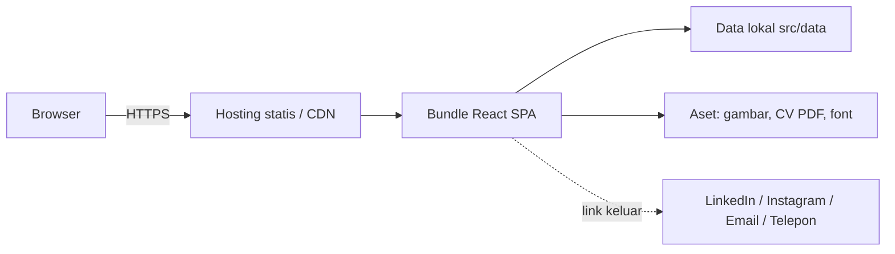

# SRS: Software Requirements Specification
## Website Portofolio Pribadi (React.js)

| | |
|---|---|
| **Versi** | 1.0 |
| **Tanggal** | 6 Oktober 2026 |
| **Acuan** | IEEE 830 / ISO 29148 (disederhanakan) |
| **Dokumen terkait** | BRD, PRD, UML, BPMN, User Stories |

---

## 1. Pendahuluan

### 1.1 Tujuan
Dokumen ini menetapkan kebutuhan perangkat lunak yang terukur dan dapat diuji untuk website portofolio pribadi, sebagai kontrak teknis antara pemilik dan pengembang (termasuk AI coding assistant).

### 1.2 Ruang Lingkup
Single-page web application (SPA) statis dengan section: Navbar, Hero, About Me, What I Can Do, Achievement, Contact. Tanpa backend dan database server.

### 1.3 Definisi dan Singkatan

| Istilah | Arti |
|---|---|
| SPA | Single Page Application |
| Scroll spy | Penanda menu aktif sesuai section yang sedang terlihat |
| Parallax | Efek layer bergerak dengan kecepatan berbeda dari konten saat scroll |
| Marquee | Track horizontal yang bergerak otomatis dan berulang |
| LCP / CLS | Largest Contentful Paint / Cumulative Layout Shift |
| FR / NFR | Functional / Non-Functional Requirement |

### 1.4 Referensi
BRD (01), PRD, UML (03), BPMN (04), User Stories (05).

---

## 2. Deskripsi Umum

### 2.1 Perspektif Produk
Aplikasi mandiri, dibangun dengan React + Vite, di-deploy sebagai situs statis di CDN (Vercel/Netlify/GitHub Pages).

### 2.2 Karakteristik Pengguna

| Pengguna | Keahlian teknis | Perangkat umum |
|---|---|---|
| Rekruiter / HRD | Menengah | Desktop, mobile |
| Dosen / akademisi | Menengah | Desktop |
| Klien / kolaborator | Menengah | Desktop, mobile |
| Masyarakat umum | Rendah | Mobile |
| Pemilik (pengelola konten) | Dasar-menengah | Desktop |

### 2.3 Lingkungan Operasi
Browser modern (Chrome, Edge, Firefox, Safari: 2 versi terakhir; Chrome Android; Safari iOS). Lebar layar 360–1920 px.

### 2.4 Batasan Desain
- Wajib React.js 18+.
- Tidak ada backend; data berada di `src/data/`.
- Hanya library yang tercantum di Bagian 6.
- Animasi hanya memakai `transform` dan `opacity`.

### 2.5 Asumsi dan Ketergantungan
Konten disediakan pemilik; hosting statis tersedia; CDN font/ikon dapat diakses (atau font di-self-host).

---

## 3. Kebutuhan Fungsional

Prioritas: **M** = Must, **S** = Should, **C** = Could.

### 3.1 Navigation Bar (NAV)

| ID | Kebutuhan | Prio | Story |
|---|---|:-:|---|
| FR-NAV-01 | Sistem menampilkan navbar di bagian atas dan tetap terlihat saat scroll (sticky). | M | US-101 |
| FR-NAV-02 | Navbar memuat menu: Home, About, What I Can Do, Achievement, Contact. | M | US-101 |
| FR-NAV-03 | Saat pointer berada di atas menu, sistem menampilkan garis bawah beranimasi dan perubahan warna dalam 250 ms. | M | US-102 |
| FR-NAV-04 | Klik menu menggulir halaman halus (smooth scroll) ke section tujuan dengan offset tinggi navbar. | M | US-103 |
| FR-NAV-05 | Menu yang sesuai section terlihat ditandai aktif (scroll spy). | S | US-103 |
| FR-NAV-06 | Pada lebar < 768 px, menu berubah menjadi hamburger yang membuka panel; panel menutup setelah menu dipilih. | M | US-104 |
| FR-NAV-07 | Setelah scroll > 50 px, navbar mendapat background blur dan bayangan halus. | S | US-101 |

### 3.2 Hero (HERO)

| ID | Kebutuhan | Prio | Story |
|---|---|:-:|---|
| FR-HERO-01 | Sistem menampilkan nama, headline, dan dua tombol CTA ("Lihat Achievement", "Hubungi Saya"). | M | US-201 |
| FR-HERO-02 | CTA menggulir ke section Achievement dan Contact. | M | US-201 |

### 3.3 About Me (ABT)

| ID | Kebutuhan | Prio | Story |
|---|---|:-:|---|
| FR-ABT-01 | Sistem menampilkan foto profil dan deskripsi diri (80–150 kata). | M | US-301 |
| FR-ABT-02 | Sistem menampilkan Nama, NIM, dan Program Studi. | M | US-302 |
| FR-ABT-03 | Sistem menampilkan pendidikan dalam timeline berurutan (terbaru di atas): jenjang, institusi, tahun. | M | US-303 |
| FR-ABT-04 | Sistem menampilkan aktivitas sebagai kartu: judul, peran, periode, keterangan. | M | US-304 |
| FR-ABT-05 | NIM dapat ditampilkan penuh atau disamarkan melalui flag `maskNim` di data. | S | US-302 |

### 3.4 What I Can Do (SKL)

| ID | Kebutuhan | Prio | Story |
|---|---|:-:|---|
| FR-SKL-01 | Sistem menampilkan Skills dikelompokkan `technical` dan `soft`. | M | US-401 |
| FR-SKL-02 | Sistem menampilkan Tools dalam grid ikon + nama. | M | US-402 |
| FR-SKL-03 | Kartu skill/tool naik 4 px dan mendapat bayangan saat hover. | S | US-401 |

### 3.5 Achievement (ACH)

| ID | Kebutuhan | Prio | Story |
|---|---|:-:|---|
| FR-ACH-01 | Setiap kartu menampilkan foto, nama pencapaian, tahun, lembaga, dan deskripsi singkat. | M | US-501 |
| FR-ACH-02 | Daftar kartu bergerak otomatis dari kanan ke kiri secara berulang tanpa jeda (marquee). | M | US-502 |
| FR-ACH-03 | Animasi berhenti saat hover (desktop) atau sentuhan (mobile) dan lanjut saat dilepas. | S | US-503 |
| FR-ACH-04 | Pada layar sentuh, pengguna dapat menggeser track secara manual. | S | US-504 |
| FR-ACH-05 | Gambar dimuat dengan lazy loading dan memiliki atribut `width`/`height`. | M | US-505 |
| FR-ACH-06 | Klik kartu membuka modal detail; modal dapat ditutup dengan tombol, klik latar, atau tombol Esc. | C | US-506 |
| FR-ACH-07 | Jika gambar gagal dimuat, sistem menampilkan placeholder netral. | S | US-505 |

### 3.6 Contact (CNT)

| ID | Kebutuhan | Prio | Story |
|---|---|:-:|---|
| FR-CNT-01 | Tombol LinkedIn membuka profil di tab baru. | M | US-601 |
| FR-CNT-02 | Tombol Instagram membuka profil di tab baru. | M | US-601 |
| FR-CNT-03 | Tombol Download CV mengunduh file PDF dengan nama `CV_<NamaAnda>.pdf`. | M | US-602 |
| FR-CNT-04 | Tautan email memakai `mailto:`. | M | US-603 |
| FR-CNT-05 | Tautan telepon memakai `tel:` (opsional tambahan tautan WhatsApp). | M | US-603 |
| FR-CNT-06 | Ikon kontak mendapat perubahan warna aksen dan skala 1,05 saat hover. | S | US-604 |
| FR-CNT-07 | Footer menampilkan teks hak cipta dengan tahun dinamis. | S | US-604 |

### 3.7 Efek Visual (FX)

| ID | Kebutuhan | Prio | Story |
|---|---|:-:|---|
| FR-FX-01 | Hero memiliki minimal 2 layer parallax dengan rasio kecepatan berbeda (sekitar 0,2× dan 0,4×). | M | US-701 |
| FR-FX-02 | Minimal satu section lain memakai parallax pada elemen dekoratif atau gambar. | S | US-701 |
| FR-FX-03 | Setiap section melakukan reveal (fade + translateY 24 px, 600 ms) sekali saat masuk viewport. | S | US-702 |
| FR-FX-04 | Jika `prefers-reduced-motion: reduce`, sistem menonaktifkan parallax, reveal, dan menghentikan marquee otomatis (diganti scroll manual). | M | US-703 |

### 3.8 Manajemen Data (DATA)

| ID | Kebutuhan | Prio | Story |
|---|---|:-:|---|
| FR-DATA-01 | Seluruh konten dibaca dari `src/data/*.js`; komponen tidak memuat teks konten secara hardcode. | M | US-902 |
| FR-DATA-02 | Menambah achievement baru cukup dengan menambah satu objek pada `achievements.js`. | M | US-902 |

---

## 4. Kebutuhan Non-Fungsional

| ID | Kategori | Kebutuhan | Metode Uji |
|---|---|---|---|
| NFR-PERF-01 | Performa | LCP < 2,5 detik pada simulasi 4G | Lighthouse |
| NFR-PERF-02 | Performa | CLS < 0,1; TBT < 200 ms | Lighthouse |
| NFR-PERF-03 | Performa | Bundle JS awal < 200 KB (gzip); gambar maks. ± 200 KB | `vite build` report |
| NFR-PERF-04 | Performa | Animasi 60 fps pada perangkat menengah; hanya `transform`/`opacity` | DevTools Performance |
| NFR-USA-01 | Usability | Pengunjung dapat mencapai kontak atau CV dalam ≤ 2 klik dari Hero | Uji pengguna |
| NFR-USA-02 | Usability | Teks isi minimal 16 px, kontras ≥ 4,5:1 | axe DevTools |
| NFR-RES-01 | Responsif | Tampil benar di 360, 768, 1024, 1440 px tanpa scroll horizontal pada body | Uji manual |
| NFR-ACC-01 | Aksesibilitas | Seluruh fitur dapat dioperasikan dengan keyboard; fokus terlihat | Uji manual |
| NFR-ACC-02 | Aksesibilitas | Semua gambar punya `alt`; ikon tanpa teks punya `aria-label` | axe DevTools |
| NFR-ACC-03 | Aksesibilitas | Mematuhi `prefers-reduced-motion` | Uji manual |
| NFR-SEC-01 | Keamanan | Link eksternal memakai `rel="noopener noreferrer"` | Review kode |
| NFR-SEC-02 | Keamanan | Seluruh akses melalui HTTPS | Cek hosting |
| NFR-SEO-01 | SEO | Title, meta description, Open Graph, favicon, satu `h1`, `sitemap.xml`, `robots.txt` | Lighthouse SEO ≥ 90 |
| NFR-CMP-01 | Kompatibilitas | Chrome, Edge, Firefox, Safari (2 versi terakhir), Chrome Android, Safari iOS | Uji manual |
| NFR-MNT-01 | Maintainability | Satu komponen satu file; konten terpisah dari tampilan; ESLint tanpa error | `npm run lint` |
| NFR-REL-01 | Keandalan | Halaman tetap terbaca bila JavaScript animasi gagal (graceful degradation) | Uji manual |

---

## 5. Arsitektur dan Antarmuka

### 5.1 Arsitektur Tingkat Tinggi



### 5.2 Antarmuka Pengguna
Lihat PRD bagian 7 (palet, tipografi, wireframe) dan UML bagian 8 (diagram komponen).

**Design tokens (Tailwind `theme.extend`)**

```js
colors: {
  bg: "#FAFAF8",
  bgAlt: "#F2F0EB",
  ink: "#1A1A1A",
  muted: "#6B6B6B",
  accent: "#B08D57",
  line: "#E6E4DF",
},
fontFamily: {
  serif: ["Playfair Display", "serif"],
  sans: ["Inter", "system-ui", "sans-serif"],
},
```

### 5.3 Antarmuka Perangkat Lunak Eksternal

| Antarmuka | Mekanisme |
|---|---|
| LinkedIn, Instagram | Hyperlink `https://` ke profil |
| Email | `mailto:alamat@email.com` |
| Telepon / WhatsApp | `tel:+62...` / `https://wa.me/62...` |
| CV | Berkas statis `/cv/CV_NamaAnda.pdf` dengan atribut `download` |

---

## 6. Spesifikasi Teknis

### 6.1 Dependensi

| Paket | Fungsi |
|---|---|
| react, react-dom (18+) | Framework UI |
| vite, @vitejs/plugin-react | Build tool |
| tailwindcss, postcss, autoprefixer | Styling |
| framer-motion | Parallax, reveal, modal |
| react-icons | Ikon |
| eslint, prettier | Kualitas kode |

### 6.2 Struktur Folder

```
portfolio/
+-- public/
|   +-- cv/CV_NamaAnda.pdf
|   +-- images/ (profile, achievements, og-image)
|   +-- favicon.ico, robots.txt, sitemap.xml
+-- src/
|   +-- components/
|   |   +-- Navbar.jsx, Hero.jsx, About.jsx, Skills.jsx
|   |   +-- Achievement.jsx, AchievementCard.jsx, AchievementModal.jsx
|   |   +-- Contact.jsx, Footer.jsx
|   |   +-- ParallaxLayer.jsx, Reveal.jsx, SectionTitle.jsx
|   +-- data/ (profile.js, skills.js, achievements.js, navigation.js)
|   +-- hooks/ (useActiveSection.js, useMediaQuery.js)
|   +-- styles/index.css
|   +-- App.jsx, main.jsx
+-- index.html
+-- tailwind.config.js, vite.config.js, package.json
```

### 6.3 Spesifikasi Komponen

| Komponen | Props | State internal | Catatan |
|---|---|---|---|
| `Navbar` | `items: {id,label}[]`, `activeId` | `isOpen`, `isScrolled` | Sticky, hamburger < 768 px |
| `Hero` | `name`, `headline` | - | Memakai 2 `ParallaxLayer` |
| `About` | `profile` | - | Berisi foto, identitas, `Timeline`, kartu aktivitas |
| `Skills` | `skills`, `tools` | - | Dua kolom di desktop |
| `Achievement` | `items` | `selected`, `paused` | Menduplikasi `items` 2× untuk loop mulus |
| `AchievementCard` | `item`, `onClick` | `imgError` | Placeholder bila gambar gagal |
| `AchievementModal` | `item`, `onClose` | - | Esc dan klik latar menutup |
| `Contact` | `contact` | - | Lima kanal kontak |
| `ParallaxLayer` | `speed`, `children` | - | `useScroll` + `useTransform` |
| `Reveal` | `children`, `delay` | - | `whileInView`, `once: true` |

### 6.4 Hooks

| Hook | Input | Output |
|---|---|---|
| `useActiveSection(ids, offset)` | daftar id section, offset navbar | `activeId` (memakai IntersectionObserver) |
| `useMediaQuery(query)` | string media query | boolean |

### 6.5 Implementasi Kunci

**Marquee kanan ke kiri (CSS)**

```css
.marquee-track { display: flex; width: max-content; animation: scroll-left 40s linear infinite; }
.marquee:hover .marquee-track, .marquee[data-paused="true"] .marquee-track { animation-play-state: paused; }
@keyframes scroll-left { from { transform: translateX(0); } to { transform: translateX(-50%); } }
@media (prefers-reduced-motion: reduce) {
  .marquee-track { animation: none; }
  .marquee { overflow-x: auto; }
}
```

**Parallax (Framer Motion)**

```jsx
const { scrollY } = useScroll();
const y = useTransform(scrollY, [0, 1000], [0, 1000 * speed]);
return <motion.div style={{ y }}>{children}</motion.div>;
```

---

## 7. Kebutuhan Data

### 7.1 Kamus Data

| Entitas | Field | Tipe | Wajib | Aturan |
|---|---|---|:-:|---|
| Profile | name | string | Ya | 2–60 karakter |
| | nim | string | Ya | Sesuai dokumen resmi |
| | major | string | Ya | |
| | headline | string | Ya | ≤ 90 karakter |
| | description | string | Ya | 80–150 kata |
| | photo | string | Ya | Path gambar, rasio 4:5 atau 1:1 |
| | maskNim | boolean | Tidak | Default `false` |
| Education | level, institution | string | Ya | |
| | startYear, endYear | number / string | Ya | `endYear` boleh "Sekarang" |
| Activity | title, role, period | string | Ya | |
| | description | string | Tidak | ≤ 160 karakter |
| Skill | name | string | Ya | |
| | category | enum | Ya | `technical` atau `soft` |
| | level | number | Tidak | 0–100 |
| Tool | name, icon | string | Ya | `icon` = nama ikon react-icons |
| Achievement | title | string | Ya | |
| | year | number | Ya | 4 digit |
| | organization | string | Ya | |
| | description | string | Ya | Maks. 2 kalimat |
| | image | string | Ya | WebP, maks. ± 200 KB |
| Contact | linkedin, instagram | string | Ya | URL `https://` |
| | email | string | Ya | Format email valid |
| | phone | string | Ya | Format `+62...` |
| | cvFile | string | Ya | Path PDF, < 2 MB |

### 7.2 Contoh Data (`src/data/profile.js`)

```js
export const profile = {
  name: "Nama Lengkap",
  nim: "2210000000",
  maskNim: false,
  major: "Sistem Informasi",
  headline: "Mahasiswa yang gemar membangun solusi digital yang rapi dan berguna.",
  description: "Tuliskan 80-150 kata tentang diri Anda di sini.",
  photo: "/images/profile.webp",
  education: [
    { level: "S1", institution: "Nama Universitas", startYear: 2022, endYear: "Sekarang" },
    { level: "SMA", institution: "Nama Sekolah", startYear: 2019, endYear: 2022 },
  ],
  activities: [
    { title: "Himpunan Mahasiswa", role: "Staf Divisi Media", period: "2023 - 2024", description: "Mengelola konten dan desain publikasi." },
  ],
  contact: {
    linkedin: "https://www.linkedin.com/in/username",
    instagram: "https://www.instagram.com/username",
    email: "nama@email.com",
    phone: "+6281234567890",
    cvFile: "/cv/CV_NamaAnda.pdf",
  },
};
```

---

## 8. Skenario Uji Penerimaan

| ID | Skenario | Langkah | Hasil yang Diharapkan | FR |
|---|---|---|---|---|
| TC-01 | Navbar sticky | Scroll ke bawah | Navbar tetap di atas dan berubah gaya | FR-NAV-01, 07 |
| TC-02 | Hover menu | Arahkan kursor ke menu | Underline bergerak, warna berubah | FR-NAV-03 |
| TC-03 | Scroll spy | Scroll ke section Achievement | Menu Achievement aktif | FR-NAV-05 |
| TC-04 | Hamburger | Lebar 375 px, klik hamburger, pilih menu | Panel terbuka lalu menutup dan halaman menggulir | FR-NAV-06 |
| TC-05 | Data About | Buka section About | Deskripsi, nama, NIM, prodi, pendidikan, aktivitas tampil | FR-ABT-01–04 |
| TC-06 | Marquee | Buka section Achievement | Kartu bergerak kanan ke kiri tanpa putus | FR-ACH-02 |
| TC-07 | Pause | Hover pada marquee | Animasi berhenti; lanjut saat kursor keluar | FR-ACH-03 |
| TC-08 | Gambar gagal | Ubah path gambar menjadi salah | Placeholder tampil | FR-ACH-07 |
| TC-09 | Unduh CV | Klik Download CV | Berkas PDF terunduh | FR-CNT-03 |
| TC-10 | Kontak | Klik LinkedIn, Instagram, email, telepon | Tab baru / aplikasi terkait terbuka | FR-CNT-01–05 |
| TC-11 | Parallax | Scroll di Hero | Layer bergerak berbeda kecepatan | FR-FX-01 |
| TC-12 | Reduced motion | Aktifkan reduce motion di OS | Parallax, reveal, marquee otomatis nonaktif | FR-FX-04 |
| TC-13 | Lighthouse | Jalankan audit produksi | Performance, Accessibility, SEO ≥ 90 | NFR-PERF, ACC, SEO |
| TC-14 | Responsif | Uji 360/768/1024/1440 px | Tata letak benar, tanpa scroll horizontal | NFR-RES-01 |
| TC-15 | Keyboard | Tekan Tab di seluruh halaman | Semua kontrol dapat difokus dan dioperasikan | NFR-ACC-01 |

---

## 9. Matriks Ketertelusuran

| BR (BRD) | FR / NFR | User Story | Test |
|---|---|---|---|
| BR-01 | FR-ABT-01–05 | US-301–304 | TC-05 |
| BR-02 | FR-SKL-01–03 | US-401–402 | TC-05 |
| BR-03 | FR-ACH-01–07 | US-501–506 | TC-06–08 |
| BR-04 | FR-CNT-01–07 | US-601–604 | TC-09, 10 |
| BR-05 | FR-NAV-01–07, FR-HERO-02 | US-101–104, 201 | TC-01–04 |
| BR-06 | FR-FX-01–04 | US-701–703 | TC-11, 12 |
| BR-07 | NFR-RES-01, NFR-CMP-01 | US-804 | TC-14 |
| BR-08 | NFR-PERF-01–04, NFR-SEO-01 | US-801, 803 | TC-13 |
| BR-09 | FR-DATA-01–02 | US-902 | Review kode |
| BR-10 | NFR-SEC-02 | US-903 | Cek hosting |
