# UML: Pemodelan Sistem
## Website Portofolio Pribadi (React.js)

> Semua diagram memakai **Mermaid**. Render di GitHub, VS Code (Markdown Preview Mermaid Support), Obsidian, Notion, atau https://mermaid.live.

| Diagram | Tujuan |
|---|---|
| 1. Use Case | Siapa melakukan apa pada sistem |
| 2. Spesifikasi Use Case | Detail skenario utama dan alternatif |
| 3. Class Diagram (data) | Struktur data konten |
| 4. Class Diagram (komponen) | Struktur komponen React |
| 5. Sequence Diagram | Urutan interaksi runtime |
| 6. Activity Diagram | Alur logika aktivitas |
| 7. State Diagram | Perubahan status komponen interaktif |
| 8. Component Diagram | Dependensi antar modul |
| 9. ER Diagram | Relasi entitas data |
| 10. Deployment Diagram | Infrastruktur rilis |

---

## 1. Use Case Diagram

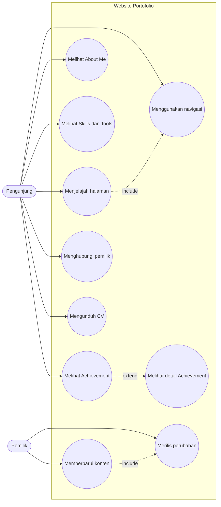

---

## 2. Spesifikasi Use Case

### UC-05: Melihat Achievement

| Item | Isi |
|---|---|
| Aktor | Pengunjung |
| Prasyarat | Halaman telah dimuat |
| Pemicu | Pengunjung menggulir atau memilih menu Achievement |
| Alur utama | 1. Sistem menggulir ke section Achievement. 2. Sistem menampilkan kartu (foto, nama, tahun, lembaga, deskripsi). 3. Kartu bergeser dari kanan ke kiri otomatis. |
| Alur alternatif A | Pengunjung hover/sentuh: animasi berhenti, lanjut saat dilepas. |
| Alur alternatif B | Pengunjung mengaktifkan reduced motion: animasi otomatis nonaktif, track dapat digulir manual. |
| Pengecualian | Gambar gagal dimuat: placeholder tampil. |
| Pascakondisi | Pengunjung melihat seluruh pencapaian. |
| Kebutuhan terkait | FR-ACH-01–07 |

### UC-08: Mengunduh CV

| Item | Isi |
|---|---|
| Aktor | Pengunjung |
| Prasyarat | Section Contact terlihat |
| Pemicu | Klik tombol Download CV |
| Alur utama | 1. Pengunjung klik tombol. 2. Browser mengunduh `CV_NamaAnda.pdf`. |
| Pengecualian | Berkas tidak ditemukan: browser menampilkan error; pemilik wajib memastikan path benar saat rilis. |
| Pascakondisi | CV tersimpan di perangkat pengunjung. |
| Kebutuhan terkait | FR-CNT-03 |

### UC-09: Memperbarui Konten

| Item | Isi |
|---|---|
| Aktor | Pemilik |
| Prasyarat | Repositori tersedia di komputer pemilik |
| Alur utama | 1. Pemilik membuka `src/data/*.js`. 2. Mengubah/menambah data atau gambar. 3. Menjalankan `npm run dev` untuk memeriksa. 4. Commit dan push. |
| Pascakondisi | Perubahan siap dirilis (UC-10). |
| Kebutuhan terkait | FR-DATA-01, FR-DATA-02 |

---

## 3. Class Diagram: Model Data

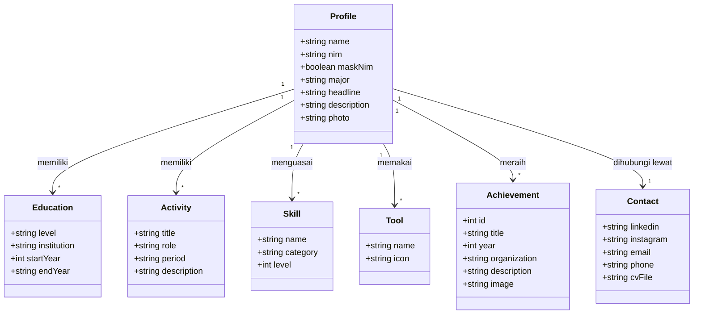

---

## 4. Class Diagram: Komponen React

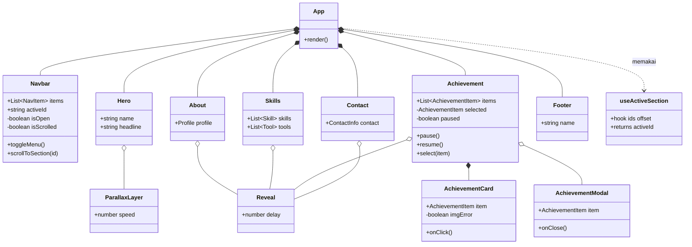

---

## 5. Sequence Diagram

### 5.1 Memuat Halaman

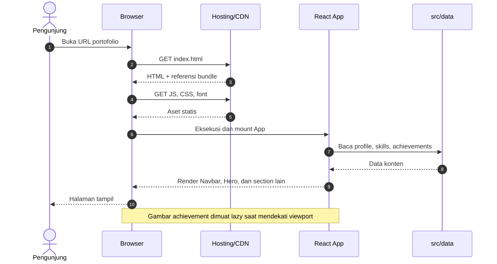

### 5.2 Klik Menu, Smooth Scroll, dan Scroll Spy

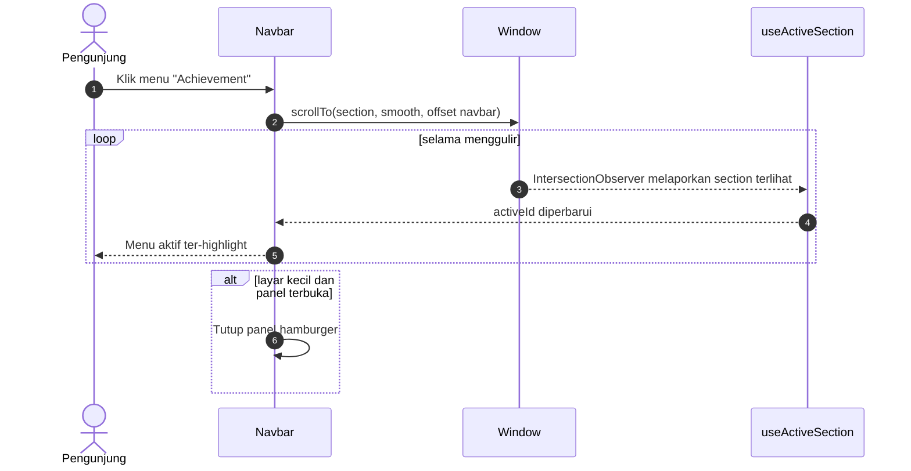

### 5.3 Pause Marquee Saat Hover

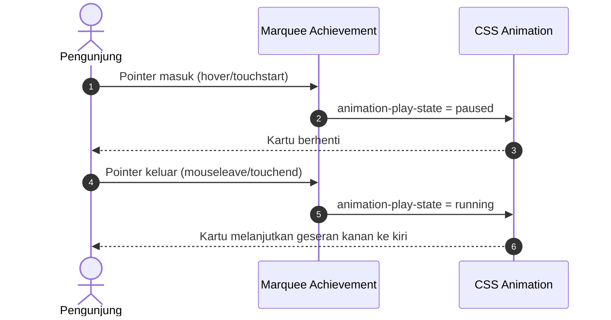

### 5.4 Membuka Detail Achievement

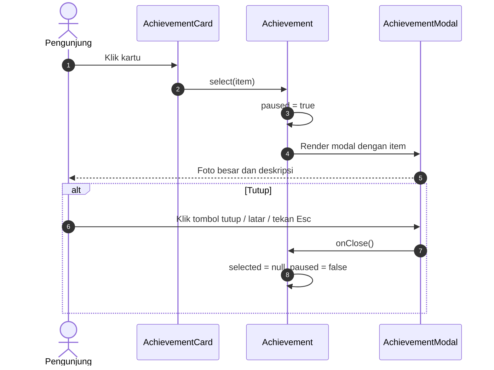

### 5.5 Mengunduh CV

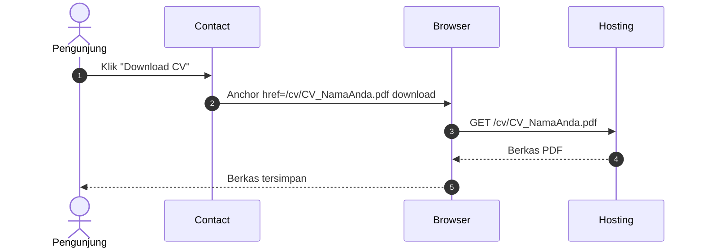

---

## 6. Activity Diagram

### 6.1 Perjalanan Pengunjung

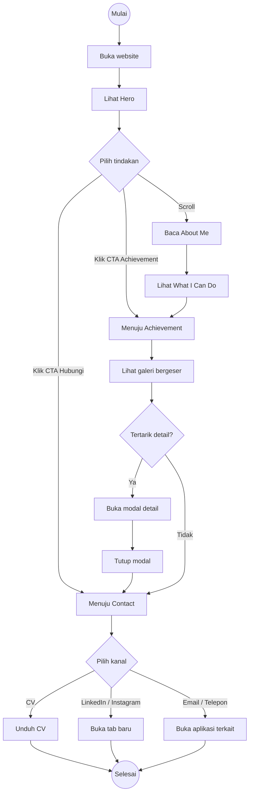

### 6.2 Logika Marquee

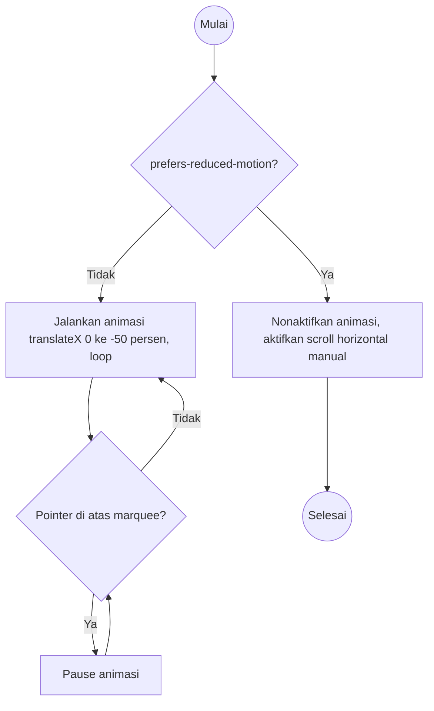

---

## 7. State Diagram

### 7.1 Menu Navbar (Mobile)

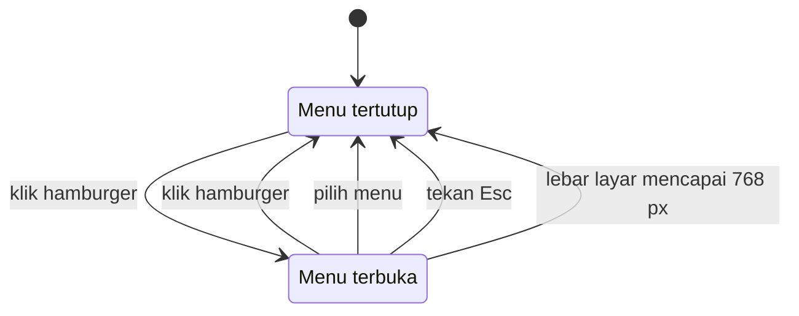

### 7.2 Gaya Navbar Saat Scroll

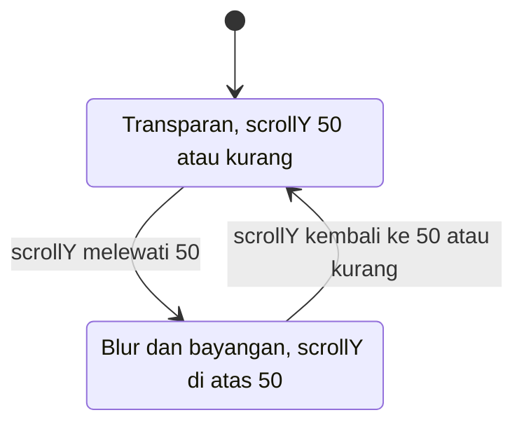

### 7.3 Marquee Achievement

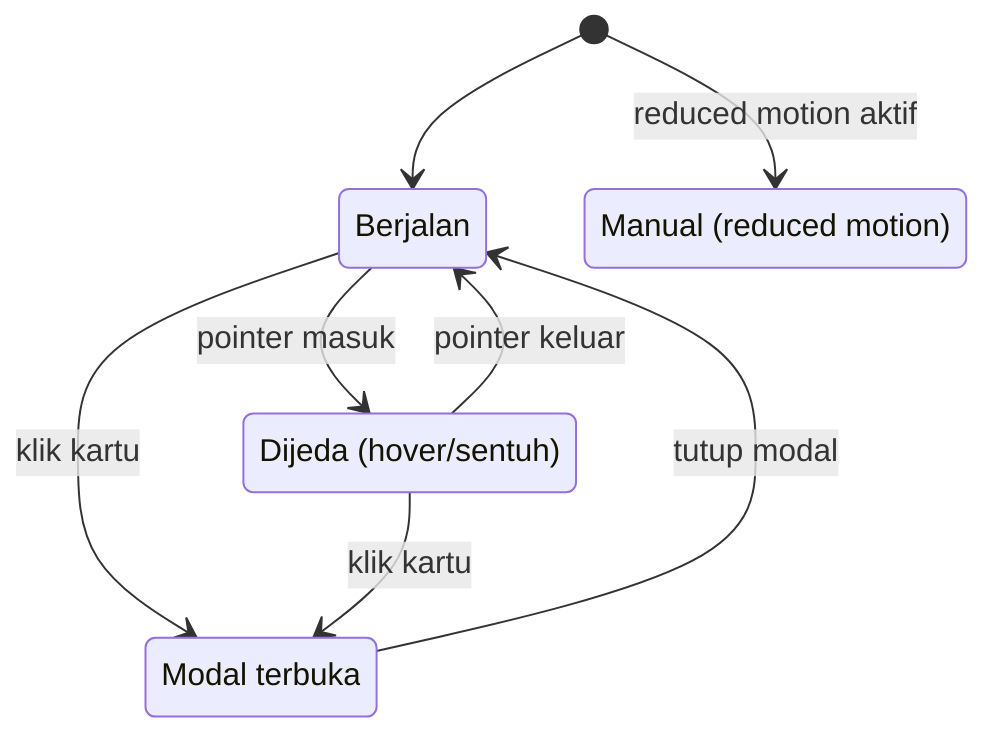

### 7.4 Pemuatan Gambar Kartu

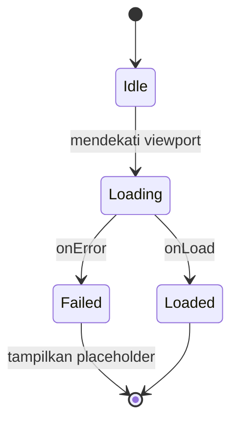

---

## 8. Component Diagram

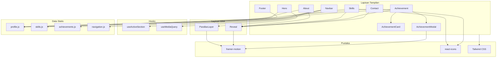

---

## 9. ER Diagram

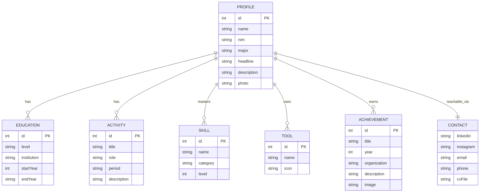

> Catatan: pada MVP entitas ini hanya berupa objek JavaScript di `src/data/`, bukan tabel database.

---

## 10. Deployment Diagram

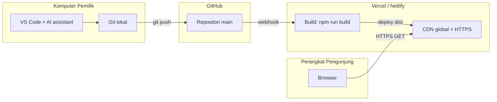
