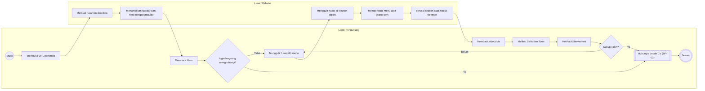
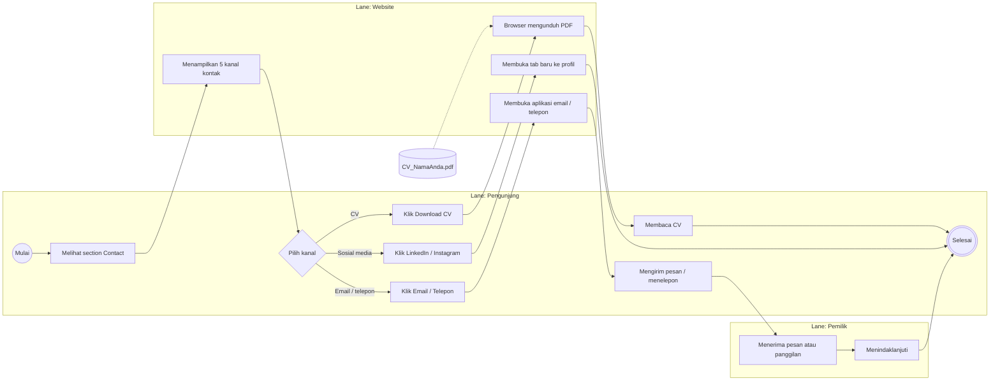
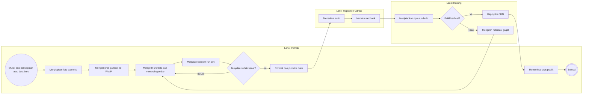
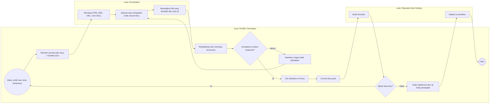
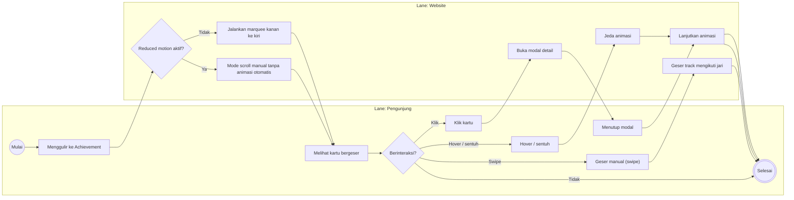

# BPMN: Pemodelan Proses Bisnis
## Website Portofolio Pribadi (React.js)

> Diagram memakai **Mermaid** yang dipetakan ke notasi BPMN 2.0 (Mermaid belum mendukung BPMN secara native). Setiap *lane* digambarkan sebagai `subgraph`. Untuk mengimpor ke Camunda Modeler, bpmn.io, atau Bizagi, gunakan tabel elemen di tiap proses sebagai acuan.

## Legenda Notasi

| Elemen BPMN | Simbol di diagram | Arti |
|---|---|---|
| Start Event | `(( ))` lingkaran | Awal proses |
| End Event | `((( )))` lingkaran ganda | Akhir proses |
| Task | `[ ]` persegi | Aktivitas yang dilakukan |
| Exclusive Gateway (XOR) | `{ }` belah ketupat | Percabangan satu jalur |
| Subprocess | `[[ ]]` | Aktivitas yang punya rincian sendiri |
| Data / Artefak | `[( )]` silinder | Berkas atau data |
| Lane / Pool | `subgraph` | Pelaku atau sistem |

Daftar proses:

| ID | Proses | Pelaku |
|---|---|---|
| BP-01 | Pengunjung menjelajah portofolio | Pengunjung, Website |
| BP-02 | Pengunjung menghubungi pemilik / mengunduh CV | Pengunjung, Website, Pemilik |
| BP-03 | Pemilik memperbarui konten | Pemilik, Repositori, Hosting |
| BP-04 | Pengembangan fitur (vibe coding) hingga rilis | Pemilik, AI Assistant, Repositori, Hosting |
| BP-05 | Interaksi galeri Achievement | Pengunjung, Website |

---

## BP-01: Pengunjung Menjelajah Portofolio

**Rincian elemen**

| Elemen | Jenis | Pelaku | Input | Output |
|---|---|---|---|---|
| Membuka URL | Task | Pengunjung | URL | Permintaan halaman |
| Memuat halaman dan data | Task | Website | HTML, JS, data lokal | Halaman ter-render |
| Menampilkan Navbar dan Hero | Task | Website | Data profil | UI awal |
| Ingin langsung menghubungi? | XOR Gateway | Pengunjung | Niat pengunjung | Jalur cepat atau jelajah |
| Menggulir halus | Task | Website | Klik menu / scroll | Posisi section |
| Cukup yakin? | XOR Gateway | Pengunjung | Informasi yang dilihat | Lanjut kontak atau lanjut menjelajah |

---

## BP-02: Menghubungi Pemilik / Mengunduh CV

**Aturan bisnis terkait:** BRL-05 (CV PDF < 2 MB), BRL-07 (link eksternal tab baru), BRL-04 (privasi nomor telepon).

---

## BP-03: Pemilik Memperbarui Konten

**Aturan bisnis terkait:** BRL-01 (kelengkapan data achievement), BRL-02 (maks. 2 kalimat), BRL-06 (klaim dapat dibuktikan), BRL-08 (ubah lewat file data).

---

## BP-04: Pengembangan Fitur (Vibe Coding) hingga Rilis

---

## BP-05: Interaksi Galeri Achievement

---

## Ringkasan Peristiwa dan Pesan (Message Flow)

| Dari | Ke | Pesan | Proses |
|---|---|---|---|
| Pengunjung | Website | Permintaan halaman (HTTP GET) | BP-01 |
| Website | Pengunjung | Halaman ter-render | BP-01 |
| Pengunjung | Browser | Klik Download CV | BP-02 |
| Browser | Hosting | GET berkas PDF | BP-02 |
| Pengunjung | Pemilik | Email / panggilan / pesan | BP-02 |
| Pemilik | Repositori | `git push` | BP-03, BP-04 |
| Repositori | Hosting | Webhook build | BP-03, BP-04 |
| Hosting | Pemilik | Notifikasi build gagal | BP-03 |

## Catatan Mengubah ke File `.bpmn`

Jika membutuhkan berkas BPMN XML asli, minta AI assistant: *"Ubah proses BP-03 dari 04_BPMN.md menjadi BPMN 2.0 XML dengan pool dan lane, siap dibuka di bpmn.io."*
